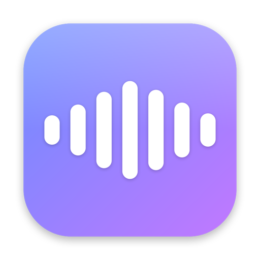

<div align="center">



# Murmur

**Hold a key. Talk. Let go.**

Push-to-talk dictation for macOS. Cleaned-up text lands in whatever text field has focus —
and the overlay that shows what you're saying never takes that focus away.
A Wispr Flow-shaped app, built native and fully on-device.

[**Website**](https://rohitshidid.github.io/murmur/) &nbsp;·&nbsp;
[**Download the DMG**](https://github.com/rohitshidid/murmur/releases/latest/download/Murmur-arm64.dmg) &nbsp;·&nbsp;
[How releases work](RELEASE.md) &nbsp;·&nbsp;
[Working on this repo](AGENTS.md)

<p>
<a href="https://github.com/rohitshidid/murmur/releases/latest"></a>
<a href="https://github.com/rohitshidid/murmur/actions/workflows/release.yml"></a>
<a href="https://github.com/rohitshidid/murmur/releases"></a>


</p>

</div>

**Status:** working skeleton. Builds, launches, arms the hotkey, transcribes, injects.
Branding and the LLM cleanup tier are the next passes.

Built on top of [per-simmons/murmur-youtube](https://github.com/per-simmons/murmur-youtube),
which is where this started — see [Credits](#credits).

---

## Coexisting with another dictation app

This app is built to run alongside other dictation tools without colliding with them, which
is not automatic on macOS and is worth understanding before changing anything:

- **Bundle ID `ai.pivotstudio.murmur`** — TCC keys Accessibility and Microphone
  grants to the bundle ID, so granting or revoking a permission here has no effect on any
  other app, and vice versa.
- **Executable `Murmur`** — space-free so `pkill -x Murmur` works at all. ⚠️ Unlike the
  old `MurmurYouTube` name, this is **no longer collision-proof**: if you ever install
  another app whose binary is also named `Murmur`, `make run` and `make install` will kill
  it too. That safety was traded away deliberately for the shorter name.
- **Hotkey is configurable** (Right ⌘ / Right ⌥ / fn) precisely because another tool may
  already own the key you'd reach for first. The event tap inspects only its own keycode
  and passes everything else through untouched.

If you run more than one dictation app, give each a different push-to-talk key. Two apps on
the same key both record, and whichever injects text will fight the other.

---

## Quick start

Either take the built one —
[**Murmur-arm64.dmg**](https://github.com/rohitshidid/murmur/releases/latest/download/Murmur-arm64.dmg),
Apple silicon, macOS 26+, ad-hoc signed so the first launch needs a right-click → Open —
or build it:

```bash
make install     # builds, bundles, signs, copies to /Applications, launches
```

Then grant two permissions — neither is optional, and neither can be requested silently:

| Permission | Where | Needed for |
|---|---|---|
| **Accessibility** | System Settings ▸ Privacy & Security ▸ Accessibility | The `CGEventTap` that sees the hotkey, and the AX text insert |
| **Microphone** | Prompted on first dictation | Audio capture |

Restart Murmur after granting Accessibility. Then hold **Right ⌘** and talk.

Two gestures on that key:

| Gesture | What happens |
|---|---|
| **Hold** | Push-to-talk. Recording stops when you let go. |
| **Tap** | Locks the mic open until you tap again. The HUD shows a lock. |
| **⌥⌘Z** | Takes back the last thing dictated. |

Tap-to-lock exists because holding a key down for a long thought is the thing that stops
people dictating anything longer than a sentence. Turn it off in Settings if you'd rather
have strict hold-to-talk.

### Why grants survive rebuilds here

TCC stores a *code-signing requirement* per entry, not just a path. An ad-hoc signature
changes on every build, so the rebuilt binary stops satisfying the stored requirement —
and the symptom is nasty: the Accessibility toggle still **shows as on** while the app is
reported untrusted, and flipping it changes nothing because the stale row is the problem.

The `Makefile` therefore signs with a stable Developer ID (auto-detected via
`security find-identity`, falling back to ad-hoc). Verified: rebuild + reinstall keeps both
grants with no re-prompt.

If a grant ever does get wedged, reset that one row and re-add — never toggle:

```bash
tccutil reset Accessibility ai.pivotstudio.murmur
tccutil reset Microphone   ai.pivotstudio.murmur
```

Always pass the bundle ID. A bare `tccutil reset Accessibility` wipes **every** app on the
machine. Then quit System Settings entirely (⌘Q) before reopening — that pane caches its
list and will otherwise show the row you just deleted.

> **Keep the build out of iCloud.** `~/Desktop` and `~/Documents` are file-provider synced
> on this machine; the sync engine can materialize/dematerialize files inside an `.app` and
> corrupt its signature. `make install` puts the running copy in `/Applications`.

Other targets: `make app` (bundle only), `make run` (run in place), `make clean`.

---

## Architecture

```
 hold key ─► HotkeyMonitor ──► DictationController ◄── Settings
                                │
                     ┌──────────┼──────────┐
                     ▼          ▼          ▼
              AudioCapture  HUDPanel   TranscriptionEngine
                     │                      │
                (AudioChunk) ──ordered──► AppleSpeechEngine
                                            │
                                       (transcript)
                                            ▼
                                      TextFormatter
                                            ▼
                                      TextInjector ─► focused app
```

### Decisions worth knowing

**The HUD must never take focus.** `HUDPanel` is a `.nonactivatingPanel` with
`canBecomeKey == false`. This is the load-bearing detail of the whole app: if the overlay
took key status, the user's text field would lose focus and there'd be nothing left to
inject into. Everything else is replaceable; this isn't.

**The hotkey needs a `CGEventTap`, not `NSEvent`.** `fn` and left/right modifier
discrimination don't surface through `NSEvent.addGlobalMonitorForEvents` or the Carbon
hotkey API. A session event tap is the only way to see them — which is why Accessibility
permission is a hard requirement rather than a nicety.

**Audio ordering is explicit.** `AudioCapture` yields into an `AsyncStream` drained by a
single task. Spawning a `Task` per buffer would be simpler and would silently corrupt the
transcript, because unstructured tasks have no ordering guarantee.

**Buffers are copied, never borrowed.** `AVAudioEngine` recycles the buffer it hands to a
tap the instant the callback returns. `AudioChunk`'s `@unchecked Sendable` is only sound
because `AudioCapture` always allocates fresh storage before handing off.

**Two swappable seams.** `TranscriptionEngine` and `TextFormatter` are protocols so the
two components most likely to change can change without touching anything else.

### Layout

```
Sources/Murmur/
├── MurmurApp.swift              @main, AppDelegate, MenuBarExtra
├── Core/
│   ├── DictationController.swift   state machine, wires everything
│   ├── HotkeyMonitor.swift         CGEventTap on .flagsChanged
│   ├── AudioCapture.swift          AVAudioEngine tap + format conversion + RMS
│   └── TextInjector.swift          AX insert, pasteboard+⌘V fallback
├── Transcription/
│   ├── TranscriptionEngine.swift   protocol + AudioChunk
│   └── AppleSpeechEngine.swift     SpeechAnalyzer / SpeechTranscriber
├── Formatting/
│   └── TextFormatter.swift         protocol + RuleBasedFormatter
├── UI/
│   ├── HUDPanel.swift              non-activating floating panel
│   └── HUDView.swift               waveform + live transcript, Brand palette
└── Support/
    ├── Settings.swift, Permissions.swift, Log.swift
```

---

## Speech engine

Default is Apple's **`SpeechAnalyzer` / `SpeechTranscriber`**, new in macOS 26: no
dependency, no bundled model, no cloud path, real streaming with `.volatileResults` so
text appears while you're still talking. The OS downloads and manages model assets, so the
first run for a locale may pause on `AssetInstallationRequest`.

The intended upgrade is **Parakeet v3** via FluidAudio (CoreML on the Neural Engine) —
measurably better English WER, ~110× realtime, ~66 MB resident. Implementing
`TranscriptionEngine` is the entire cost of switching; `DictationController` doesn't
change.

| | Apple SpeechTranscriber | Parakeet v3 (FluidAudio) | Whisper large-v3 (WhisperKit) |
|---|---|---|---|
| Dependency | none | SwiftPM | SwiftPM |
| Model download | OS-managed | ~600 MB | ~1.5 GB |
| English accuracy | good | best | good |
| Languages | many | 25 | 99 |
| Latency | low | ~80 ms | 200–500 ms |

---

## Beyond dictation

**Meeting mode.** A second capture path records your microphone and the Mac's own audio as
two separate tracks, transcribes both, diarizes the remote one, and produces an attributed
transcript with timestamps — exportable to Markdown, plain text, SRT or WebVTT. Keeping the
tracks apart is what makes "You" exact: the diarizer only has to separate the remote voices
from each other, never to pull your own voice out of a mixdown it dominates.

System audio is captured with a **CoreAudio process tap**, not ScreenCaptureKit. `SCStream`
needs far less code, but it is a screen-recording API and asks the user for Screen Recording
permission — too broad a grant for a feature that only needs sound.

**The audio is never kept.** A meeting is minutes of everyone in the room; the transcript is
what the feature is for.

## Not built yet

1. **Command Mode.** Select text, hold a second hotkey, say "make this more formal."
   Needs AX read of `kAXSelectedTextAttribute` plus an LLM round-trip.
2. **File transcription.** Drop an audio or video file and get a transcript. The engine
   protocol needs no changes — only a reader that yields `AudioChunk`s from `AVAssetReader`
   instead of `AVAudioEngine`.
3. **Multilingual.** `AppleSpeechEngine` pins `Locale.current` at init; per-utterance
   language choice and auto-detection are not wired up.
4. **Onboarding.** A first-run window that walks through the permissions instead of
   relying on the menu's "Grant…" items.
5. **Developer ID signing + notarization.** Ends the TCC-reset churn and makes the app
   distributable. Without a cert the `Makefile` falls back to ad-hoc signing, and **every
   rebuild invalidates the Accessibility grant** — see below.

---

## Verified

Driven with a synthetic Right ⌥ hold (`scratchpad/ptt/ptt2.swift` posts `flagsChanged`
events) and confirmed via `/usr/bin/log show --predicate 'subsystem ==
"ai.pivotstudio.murmur"'`:

- Builds clean under Swift 6 strict concurrency.
- Signs with Developer ID; grants survive rebuild + reinstall.
- Launches as an accessory app, no Dock icon, menu bar item present.
- Event tap arms on grant without a restart (the poller catches it).
- Full state machine: `starting → listening → finishing → idle`, no errors.
- `SpeechAnalyzer` starts; models already installed, no download stall.
- Audio capture runs and converts native 48 kHz → 16 kHz for the engine.
- HUD renders bottom-center at `{{790, 96}, {340, 76}}` without taking focus.
- Silence produces an empty transcript and injects nothing.

**Not yet verified:** speech → transcript → cleanup → injection. Synthetic key events
can't produce audio, so this needs a human to hold the key and talk.

> `log` is shadowed in this shell — use `/usr/bin/log` explicitly or it returns nothing.

---

## Releasing

Bump `CFBundleShortVersionString` in `Resources/Info.plist` and push. CI does the rest —
tests, builds the DMG on a clean macOS 26 runner, tags the commit, publishes the release.
`./release.sh` is the safe front door to that. Full explanation in [RELEASE.md](RELEASE.md).

The website lives in `docs/` and is served by GitHub Pages straight from `main`. Its
Download buttons point at `/releases/latest/download/Murmur-arm64.dmg`, which GitHub
resolves server-side — so **the site never needs rebuilding when you release**.

---

## Credits

Murmur is built on top of
**[per-simmons/murmur-youtube](https://github.com/per-simmons/murmur-youtube)** — that
project is where the idea and the first working version came from, and this one grew out of
it. Full credit and thanks.

**Licence:** none chosen yet, here or upstream, so this is source-available rather than
open source for the moment. Read it, build it, use it; if you want to redistribute it,
open an issue and it can be sorted out properly.
